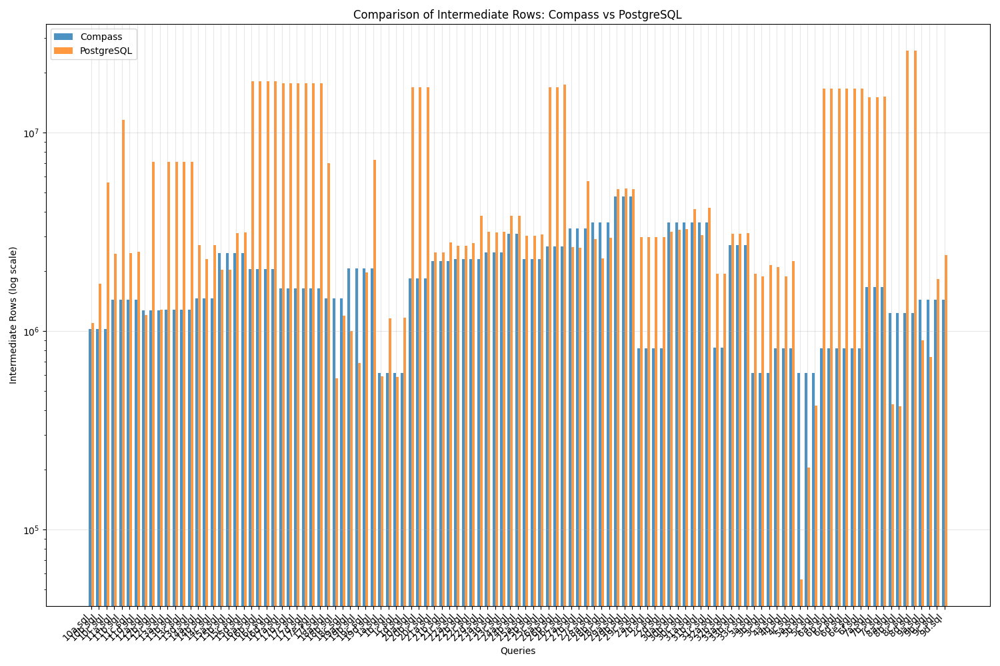

# Análisis
- [x] Cardinalidad
- [x] Distancia L1
- [x] Tiempo de Ejecución
- [x] Porcentaje de Éxito

## Gráficas
Las siguientes gráficas se generaron como parte del análisis:

1. **Comparación de Cardinalidad**
   
   Esta gráfica compara el número de filas intermedias generadas entre Compass y PostgreSQL. Se observa que PostgreSQL (naranja) tiende a generar muchas más filas intermedias, con picos que llegan hasta 107 filas, mientras que Compass (azul) mantiene un nivel más constante y eficiente.

2. **Ratio de Cardinalidad**
   
   Esta gráfica muestra la proporción de filas intermedias entre PostgreSQL y Compass. Las barras verdes por encima de 1.0 indican cuántas veces más filas genera PostgreSQL. En algunos casos, PostgreSQL genera hasta 100 veces más filas intermedias que Compass.

3. **Análisis de Consultas Individuales**
   
   Esta gráfica muestra el comportamiento de cada sistema por consulta. Se puede observar que PostgreSQL (rojo) tiene más variabilidad y picos más pronunciados, mientras que Compass (azul) mantiene un comportamiento más estable.

4. **Análisis de Distancia L1**
   
   Se muestran dos gráficas importantes:
   - Superior: Correlación (0.78) entre el número de tablas y la distancia L1
   - Inferior: Distancia L1 promedio por familia de consultas, donde el tamaño de los puntos indica el número de consultas en cada familia

5. **Tiempo de Ejecución**
   
   Comparación de tiempos de ejecución donde:
   - Compass (azul): Varía entre 0.02 y 0.28 segundos
   - PostgreSQL (naranja): Consistentemente por debajo de 0.05 segundos
   - PostgreSQL es más rápido pero menos eficiente en uso de memoria

6. **Análisis de Consultas Ganadoras**
   
   Muestra dos aspectos clave:
   - Izquierda: Victoria total (Compass: 87 consultas [77%], PostgreSQL: 26 consultas [23%])
   - Derecha: Distribución por número de joins:
     * 4-9 joins: Bastante parejo (Compass: 11, PostgreSQL: 13)
     * 10-19 joins: Ventaja PostgreSQL (Compass: 3, PostgreSQL: 13)
     * 20-28 joins: Dominio Compass (Compass: 24, PostgreSQL: 0)

## Hallazgos Clave

1. **Gestión de Complejidad**:
   - Compass sobresale en consultas complejas (20+ joins)
   - PostgreSQL es mejor en consultas simples
   - La brecha de rendimiento aumenta con la complejidad

2. **Uso de Recursos**:
   - Compass: Menos filas intermedias, mayor tiempo de ejecución
   - PostgreSQL: Más rápido pero genera más filas intermedias
   - Diferentes prioridades de optimización entre sistemas

3. **Patrones de Optimización**:
   - Fuerte correlación entre distancia L1 y complejidad
   - Comportamiento consistente dentro de familias de consultas
   - Cada sistema muestra sus fortalezas en diferentes escenarios

4. **Recomendaciones de Uso**:
   - Usar Compass para:
     * Consultas complejas
     * Entornos con memoria limitada
     * Cuando el tamaño de resultados intermedios es crítico
   - Usar PostgreSQL para:
     * Consultas simples a moderadas
     * Cuando la velocidad de ejecución es prioritaria
     * Cuando hay abundantes recursos de memoria

