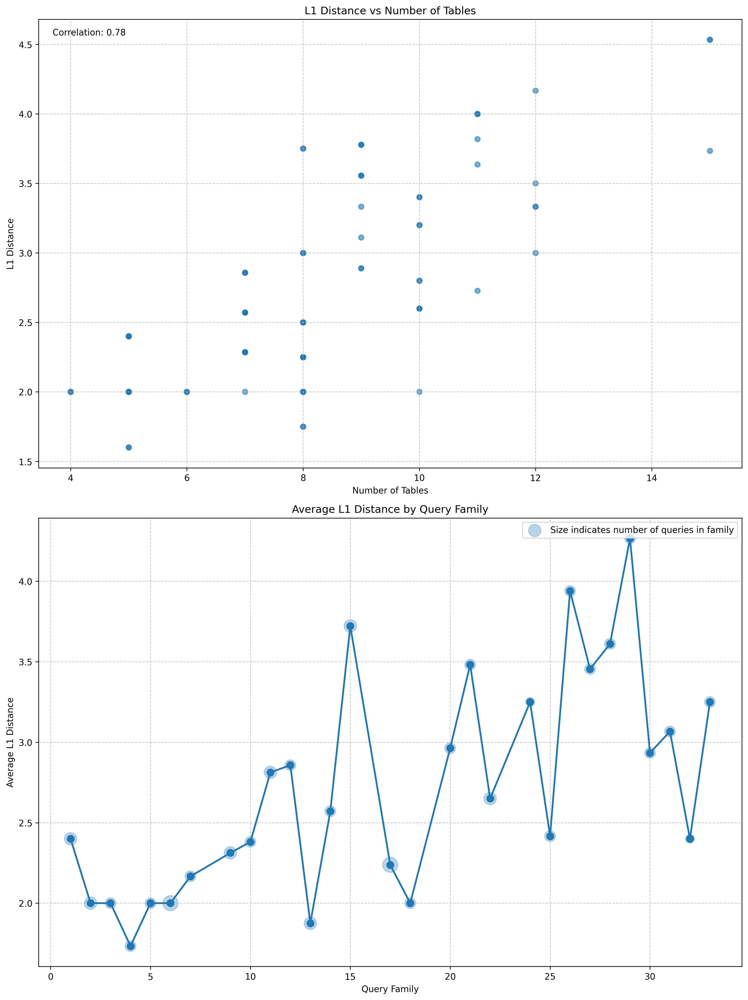

# Analysis
- [x] Cardinality
- [x] L1 Distance
- [x] Runtime
- [x] Winning percentage

## Plots

The following plots are generated as part of the analysis:

1. **Cardinality Comparison**
   
   This plot compares the cardinality (number of elements) between different datasets or queries, helping to visualize differences in data size or distribution.

2. **Cardinality Ratio**
   
   This plot illustrates the ratio of cardinalities between datasets or queries, providing insight into relative sizes or proportions.

3. **Individual Queries Analysis**
   
   This plot analyzes individual queries, highlighting performance metrics or results for each query.

4. **L1 Distance Analysis**
   
   This plot represents the L1 distance (sum of absolute differences) between datasets or query results, useful for measuring similarity or divergence.

5. **Runtime**
   
   This plot shows the runtime performance of different queries or processes, helping to identify bottlenecks or efficiency improvements.

6. **Winning Queries Analysis**
   
   This plot analyzes "winning" queries, possibly those with the best performance or results.
